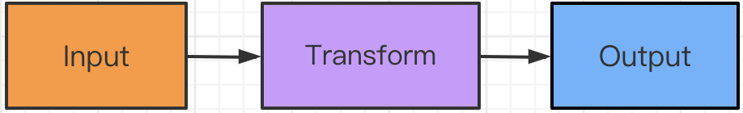

# [Flink DataStream API](https://www.cnblogs.com/cjsblog/p/12967555.html)

### 1. API基本概念

Flink程序可以对分布式集合进行转换（例如： filtering, mapping, updating state, joining, grouping, defining windows, aggregating）

集合最初是从源创建的（例如，从文件、kafka主题或本地内存集合中读取）

结果通过sink返回，例如，可以将数据写入(分布式)文件，或者写入标准输出(例如，命令行终端)

根据数据源的类型（有界或无界数据源），可以编写**批处理程序**或**流处理程序**，其中**使用DataSet API进行批处理**，并**使用DataStream API进行流处理**。

Flink有特殊的类**DataSet**和**DataStream**来表示程序中的数据。在DataSet的情况下，数据是有限的，而对于DataStream，元素的数量可以是无限的。 

Flink程序看起来像转换数据集合的常规程序。每个程序都包含相同的基本部分：

- 获取一个执行环境
- 加载/创建初始数据
- 指定数据上的转换
- 指定计算结果放在哪里
- 触发程序执行

 

为了方便演示，先创建一个项目，可以从maven模板创建，例如：

[](javascript:void(0);)

```
mvn archetype:generate \
      -DarchetypeGroupId=org.apache.flink \
      -DarchetypeArtifactId=flink-quickstart-java \
      -DarchetypeVersion=1.10.0 \
      -DgroupId=com.cjs.example \
      -DartifactId=flink-quickstart \
      -Dversion=1.0.0-SNAPSHOT \
      -Dpackage=com.cjs.example.flink \
      -DinteractiveMode=false
```

[](javascript:void(0);)

也可以直接创建SpringBoot项目，自行引入依赖：

[](javascript:void(0);)

```
<dependency>
    <groupId>org.apache.flink</groupId>
    <artifactId>flink-java</artifactId>
    <version>1.10.0</version>
    <scope>provided</scope>
</dependency>
<dependency>
    <groupId>org.apache.flink</groupId>
    <artifactId>flink-streaming-java_2.11</artifactId>
    <version>1.10.0</version>
    <scope>provided</scope>
</dependency>
<dependency>
    <groupId>org.apache.flink</groupId>
    <artifactId>flink-connector-kafka-0.10_2.11</artifactId>
    <version>1.10.0</version>
</dependency>
```

[](javascript:void(0);)

StreamExecutionEnvironment是所有Flink程序的基础。你可以在StreamExecutionEnvironment上使用以下静态方法获得一个：

```
getExecutionEnvironment()

createLocalEnvironment()

createRemoteEnvironment(String host, int port, String... jarFiles)
```

通常，只需要使用getExecutionEnvironment()即可，因为该方法会根据上下文自动推断出当前的执行环境

从文件中读取数据，例如：

```
final StreamExecutionEnvironment env = StreamExecutionEnvironment.getExecutionEnvironment();

DataStream<String> text = env.readTextFile("file:///path/to/file");
```

对DataStream应用转换，例如：

[](javascript:void(0);)

```
DataStream<String> input = ...;

DataStream<Integer> parsed = input.map(new MapFunction<String, Integer>() {
    @Override
    public Integer map(String value) {
        return Integer.parseInt(value);
    }
});
```

[](javascript:void(0);)

通过创建一个sink将结果输出，例如：

```
writeAsText(String path)

print()
```

最后，调用StreamExecutionEnvironment上的execute()执行：

```
//  Triggers the program execution
env.execute();

//  Triggers the program execution asynchronously
final JobClient jobClient = env.executeAsync();
final JobExecutionResult jobExecutionResult = jobClient.getJobExecutionResult(userClassloader).get();
```

下面通过单词统计的例子来加深对这一流程的理解，WordCount程序之于大数据就相当于是HelloWorld之于Java，哈哈哈

[](javascript:void(0);)

```
package com.cjs.example.flink;

import org.apache.flink.api.common.functions.FlatMapFunction;
import org.apache.flink.api.java.DataSet;
import org.apache.flink.api.java.ExecutionEnvironment;
import org.apache.flink.api.java.tuple.Tuple2;
import org.apache.flink.util.Collector;

/**
 * Map-Reduce思想
 * 先分组，再求和
 * @author ChengJianSheng
 * @date 2020-05-26
 */
public class WordCount {
    public static void main(String[] args) throws Exception {
        ExecutionEnvironment env = ExecutionEnvironment.getExecutionEnvironment();
        DataSet<String> text = env.readTextFile("/Users/asdf/Desktop/input.txt");
        DataSet<Tuple2<String, Integer>> counts =
                // split up the lines in pairs (2-tuples) containing: (word,1)
                text.flatMap(new Tokenizer())
                        // group by the tuple field "0" and sum up tuple field "1"
                        .groupBy(0)
                        .sum(1);
        
        counts.writeAsCsv("/Users/asdf/Desktop/aaa", "\n", " ");
        env.execute();
    }

    static class Tokenizer implements FlatMapFunction<String, Tuple2<String, Integer>> {
        @Override
        public void flatMap(String value, Collector<Tuple2<String, Integer>> out) throws Exception {
            // normalize and split the line
            String[] tokens = value.toLowerCase().split("\\W+");

            // emit the pairs
            for (String token : tokens) {
                if (token.length() > 0) {
                    out.collect(new Tuple2<>(token, 1));
                }
            }
        }
    }
}
```

[](javascript:void(0);)

为Tuple定义keys

Python中也有Tuple（元组）

```
DataStream<Tuple3<Integer,String,Long>> input = // [...]
KeyedStream<Tuple3<Integer,String,Long>,Tuple> keyed = input.keyBy(0)
```

元组按第一个字段(整数类型的字段)分组

还可以使用POJO的属性来定义keys，例如：

[](javascript:void(0);)

```
// some ordinary POJO (Plain old Java Object)
public class WC {
  public String word;
  public int count;
}
DataStream<WC> words = // [...]
DataStream<WC> wordCounts = words.keyBy("word").window(/*window specification*/);
```

[](javascript:void(0);)

先来了解一下KeyedStream


因此可以通过KeySelector方法来自定义

[](javascript:void(0);)

```
// some ordinary POJO
public class WC {public String word; public int count;}
DataStream<WC> words = // [...]
KeyedStream<WC> keyed = words
  .keyBy(new KeySelector<WC, String>() {
     public String getKey(WC wc) { return wc.word; }
   });
```

[](javascript:void(0);)

如何指定转换方法呢？

方式一：匿名内部类

```
data.map(new MapFunction<String, Integer> () {
    public Integer map(String value) { return Integer.parseInt(value); }
});
```

方式二：Lamda

```
data.filter(s -> s.startsWith("http://"));
data.reduce((i1,i2) -> i1 + i2);
```

\2. DataStream API

下面这个例子，每10秒钟统计一次来自Web Socket的单词次数

[](javascript:void(0);)

```
package com.cjs.example.flink;

import org.apache.flink.api.common.functions.FlatMapFunction;
import org.apache.flink.api.java.tuple.Tuple2;
import org.apache.flink.streaming.api.datastream.DataStream;
import org.apache.flink.streaming.api.environment.StreamExecutionEnvironment;
import org.apache.flink.streaming.api.windowing.time.Time;
import org.apache.flink.util.Collector;

public class WindowWordCount {

    public static void main(String[] args) throws Exception {
        StreamExecutionEnvironment env = StreamExecutionEnvironment.getExecutionEnvironment();

        DataStream<Tuple2<String, Integer>> dataStream = env.socketTextStream("localhost", 9999)
                .flatMap(new Splitter())
                .keyBy(0)
                .timeWindow(Time.seconds(10))
                .sum(1);

        dataStream.print();

        env.execute("Window WordCount");
    }

    static class Splitter implements FlatMapFunction<String, Tuple2<String, Integer>> {
        @Override
        public void flatMap(String value, Collector<Tuple2<String, Integer>> out) throws Exception {
            String[] words = value.split("\\W+");
            for (String word : words) {
                out.collect(new Tuple2<String, Integer>(word, 1));
            }
        }
    }
}
```

[](javascript:void(0);)

为了运行此程序，首先要在终端启动一个监听

```
nc -lk 9999
```

 

https://ci.apache.org/projects/flink/flink-docs-release-1.10/dev/datastream_api.html 